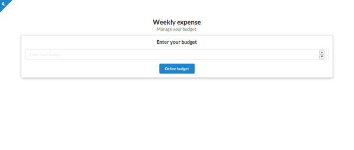

<div align="center">

# Budget

[Getting Started](#getting-started) | [Prerequisites](#prerequisites) | [Installation](#installation) | [Built With](#built-with)

</div>

<div align="center">
  
</div>

## Getting Started

Budget with Hooks.

### Prerequisites

Install the [ESLint](https://github.com/Microsoft/vscode-eslint) extension if you use Visual Studio Code.

### Installation

**Step 1:** Clone or download the repo.

**Step 2:** Switch to your repository's directory.

```
cd /path/to/your/repo
```

**Step 3:** Install dependencies.

```
yarn install
```

**Step 4:** Run the server.

```
yarn start
```

## Built With

- [React](https://reactjs.org/) - A JavaScript library for building user interfaces.
- [Semantic UI](https://semantic-ui.com/) - Development framework that helps create beautiful, responsive layouts using human-friendly HTML.

Made with ❤ by bryandms.
